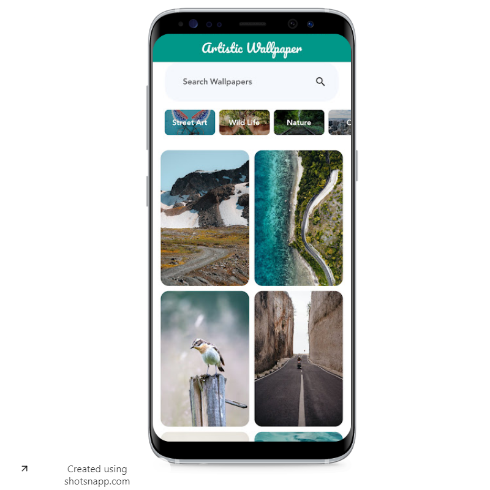
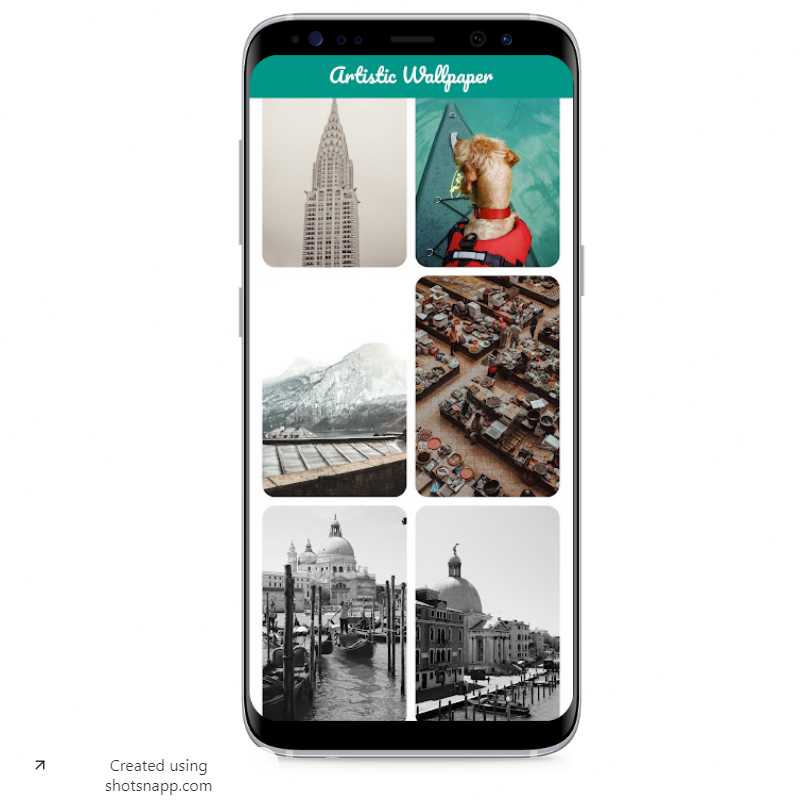
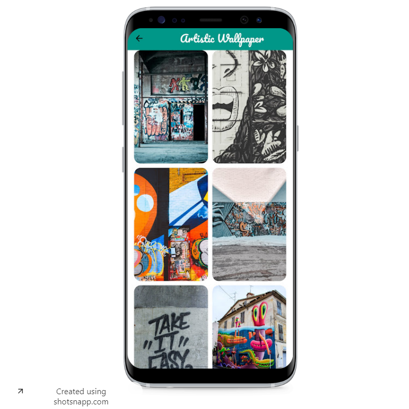
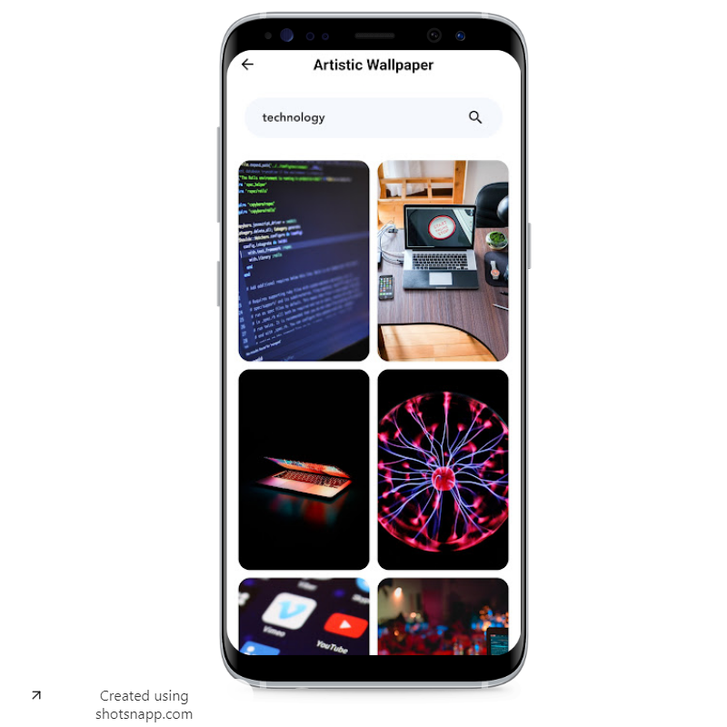
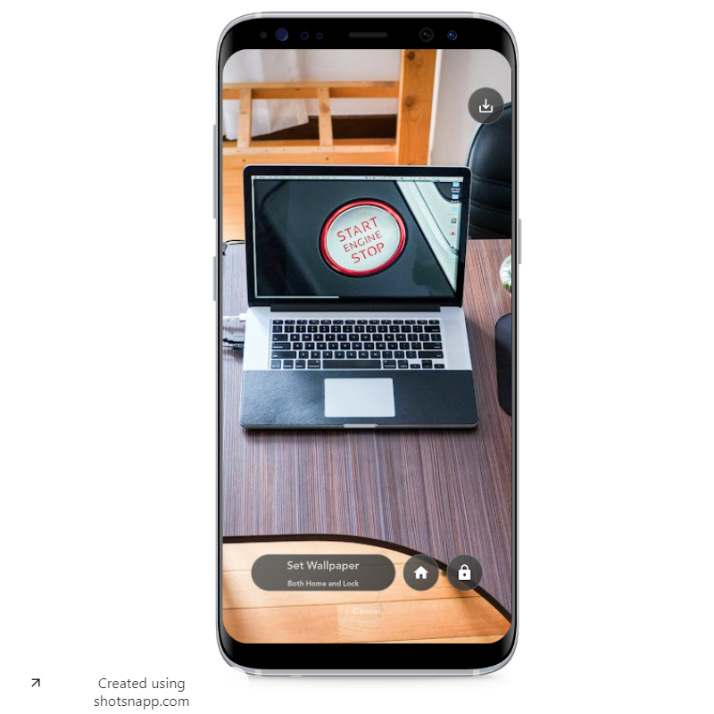

# artisticwallpaper

A Wallpaper Project to save images for home and lock screens and download wallpapers.

Star ⭐ the repo if you like what you see😉.

#### How to Install?

```
git clone https://github.com/omarabdullah1/artisitcwallpaper.git
cd artisticwallpaper
flutter packages get
flutter run -d chrome
```

#### Looks

<table>
  <tr>
    <td></td>
    <td></td>
    <td></td>
    <td></td>
    <td></td>
  </tr>
</table>
